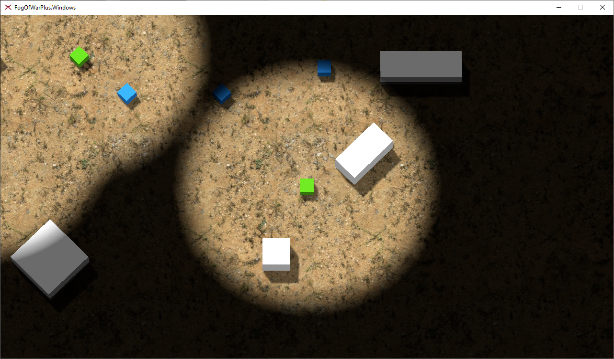

# Xenko FogOfWarPlus Moba/RTS/Platformer (System)

This is a fog of war system written for Xenko, it is comprised of the following components:
- A dual camera system, one perspective camera, one orthographic camera
- Orthographic camera renders to a texture in an isolated render group, this is used by the fog of war shader material
- Fog of war shader is applied as a Transparency layer on the fog of war material and returns alphas based on render texture
- Fog of war is two layers for elegance, one layer is rendered with depth, the other is the final pass in the compositor
- Fog configuration can be modified on the fog of war system prefab through game studio
- Detectors register with the fog of war system leveraging services registry
- Subscribers (enemies) register with the fog of war system leveraging services registry
- Subscribers check distance to the camera, if within range they then check distance to registered detectors
- Subscribers have a number of shortcuts out of n(n-1)/2 iteration, if fully visible they cease iteration.
- Subscribres (enemy material) uses a unit shader applied as a transparency material which modifies alpha based on distance
- Fog blending can be modified through a dedicated set of post processing effects
- Game profiler is attached, control-shift-p, WASD to move around

 
  
 [Video can be found here](https://www.youtube.com/watch?v=HPWxhYZBDSQ)

**NOTE: This could be further enhanced without the use of vector distance checking by passing a map-only render texture through to a sprite
batch draw or the back buffer and using pixels from the fog texture to draw pixels from the map-only texture (darkened or grayscale) for 
unrevealed terrain; however I had issues separating shadows into their own pipeline in the current state and this is workable.

Update runs at ~2.75-2.9ms on my system.

To use:
- Explore the layout in Game Studio, the fog of war system prefab is nested under the player
- Register detectors and subscribers with the fog of war system by adding the prefab to your entities
- Modify fog of war settings on the fog of war system prefab
- M

## Xenko FogOfWarGridSystem
I am currently planning a fog of war grid system that will allow for dynamic line of sight.
