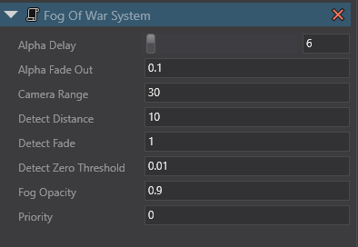

# Stride FogOfWarPlus Moba/RTS/Platformer (System)

This is a fog of war system written for Stride, it is comprised of the following components:
- A dual camera system, one perspective camera, one orthographic camera
- Orthographic camera renders to a texture in an isolated render group, this is used by the fog of war shader material
- Fog of war shader is applied as a Transparency layer on the fog of war material and leverages Alpha value
- Fog of war is two layers for elegance, one layer is rendered with depth, the other is the final pass in the compositor
- Fog configuration can be modified on the fog of war system prefab through game studio
- Detectors register with the fog of war system using services registry - just add the prefab to entity
- Subscribers (enemies) register with the fog of war system leveraging services registry - just add prefab to entity
- Subscribers check distance to the camera, if within range they then check distance to registered detectors
- Subscribers have a number of shortcuts out of n(n-1)/2 iteration, if fully visible they cease iteration.
- Subscribers (enemy material) uses a unit shader applied as a transparency which modifies alpha values
- Fog blending can be modified through a dedicated set of post processing effects
- Game profiler is attached, control-shift-p to disable, WASD to move around

#### In theory you could do this without needing the enemy shaders and distance checking, if you could render only the map with no units. Unfortunately I have spent many cycles trying to do this and the issue is, I can't work out how to remove shadows from the units. It's not as easy as a simple render group to render texture pass, shadows are handled in their own render stage.

 

Update runs at ~2.5ms on my system.

To use:
- Explore the layout in Game Studio, the fog of war system prefab is nested under the player
- Register detectors and subscribers with the fog of war system by adding the corresponding prefab to your entities
- Modify fog of war settings on the fog of war system prefab

 

### Note: You may need to clean the build, and use Stride VSX plugin to clean intermediate assets in Stride, then build the game from Game Studio to get the shader to recompile.
